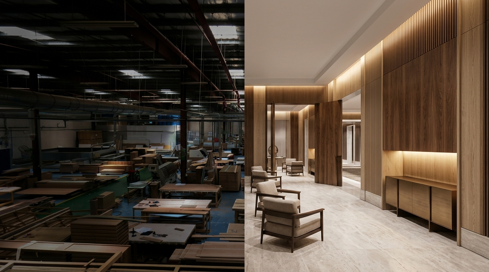

# Polaris International Industries LLC — Production Landing Page

> Premium architectural React.js landing page for **Polaris International Industries LLC**, a premier Dubai-based furniture manufacturing and interior fit-out partner operating an advanced 45,000 sq. ft. purpose-built facility in Dubai Investment Park (DIP 2).



---

## 🌟 Highlights & Brand Positioning

Polaris is an integrated industrial manufacturing powerhouse delivering turn-key bespoke furniture, fitted joinery, fire-rated doors, metalworks, and decorative glazing across the GCC and internationally.

- **45,000 Sq. Ft. Manufacturing Plant:** Industrial setup in Dubai Investment Park (DIP 2), UAE.
- **Full Turnkey Capabilities:** Woodwork, Multi-Axis CNC Machining, Master Dry-Fit Assembly, Hydraulic Veneer Pressing, Dust-Free Spray Booths, Specialized Metal Fabrication, and Upholstery Atelier.
- **Verified Credentials:** ISO 9001 (Quality Management), ISO 14001 (Environmental Management), and ISO 45001 (Health & Safety).
- **Landmark Hospitality & Luxury Portfolios:** The Dorchester Collection, The Dubai EDITION, Ritz-Carlton Ballroom & Spa, St. Regis Residences, LIV LUX Tower, Radisson Blu Palm Jumeirah, Four Points by Sheraton, and private palatial villas across Dubai Hills Estate and Tilal Al Ghaf.
- **Global Presence:** Regional strategic offices in Dubai (UAE), London (UK), Kingdom of Saudi Arabia (Riyadh/Dammam), and India (Mumbai/Bangalore).

---

## 🛠️ Technology Stack

- **Framework:** React 18
- **Build Tool:** Vite
- **Styling:** Handcrafted Architectural Vanilla CSS Design System (no heavy utility dependencies, optimized for 60fps performance)
- **Typography:** [Cormorant Garamond](https://fonts.google.com/specimen/Cormorant+Garamond) (Serif Display) + [Plus Jakarta Sans](https://fonts.google.com/specimen/Plus+Jakarta+Sans) (Modern Architectural Body)
- **Motion & Interactions:** Framer Motion (cinematic ease transitions, accordions, and overlays)
- **Icons:** Lucide React

---

## 📁 Project Architecture

```
polaris/
├── public/
│   └── assets/
│       ├── brands/          # Verified client brand marks (Accor, Marriott, St. Regis, etc.)
│       ├── capabilities/    # 6 core disciplines imagery
│       ├── certificates/    # Authentic ISO 9001, 14001, 45001 certificates
│       ├── facility/        # Real 45,000 sq. ft. DIP factory floor photography
│       ├── hero/            # Master cinematic 16:9 hero background & posters
│       ├── logo/            # Polaris official emblem
│       ├── materials/       # Tactile closeups (veneer, grain, metals, stone)
│       ├── projects/        # Landmark hospitality, high-rise, and palatial villa projects
│       └── videos/          # Full-screen ambient cinematic hero video loop
│
├── src/
│   ├── components/
│   │   ├── Navbar.jsx               # Transparent-to-translucent blur header + mobile drawer
│   │   ├── Hero.jsx                 # 100vh cinematic hero with video loop & playback control
│   │   ├── IntroSection.jsx         # Asymmetrical editorial profile (45k sq.ft., DIP)
│   │   ├── ManufacturingSection.jsx # Industrial scale stats & interactive production bays
│   │   ├── Capabilities.jsx         # 6 core disciplines (desktop hover preview + mobile accordion)
│   │   ├── MaterialsSection.jsx     # Material → Craft → Precision → Finished Space
│   │   ├── FacilitySection.jsx      # 5-stage horizontal sequence (Woodwork to Production)
│   │   ├── ProjectsPreview.jsx      # Filterable project gallery with detailed scope modal
│   │   ├── CredibilitySection.jsx   # Real ISO certificates & brand operator roster
│   │   ├── GlobalPresence.jsx       # Strategic regional offices & landmark countries
│   │   ├── FinalCTA.jsx             # Closing call-to-action
│   │   ├── Footer.jsx               # Plant location, operating hours & tender contacts
│   │   └── ProjectModal.jsx         # Interactive RFQ / Tender inquiry modal
│   │
│   ├── data/
│   │   ├── capabilities.js
│   │   ├── projects.js
│   │   └── company.js
│   │
│   ├── index.css                    # Comprehensive architectural Vanilla CSS system
│   ├── App.jsx                      # Narrative assembly of all 11 sections
│   └── main.jsx
│
├── index.html                       # Vite entry point with SEO metadata
├── vite.config.js
└── package.json
```

---

## 🚀 Getting Started

### Prerequisites
- Node.js (v18+ recommended)
- npm or yarn

### Installation
```bash
# 1. Clone repository
git clone https://github.com/yashkolekar1/polarisfurniture.git

# 2. Navigate to directory
cd polarisfurniture

# 3. Install dependencies
npm install

# 4. Start local development server
npm run dev
```

Visit `http://localhost:5173/` in your browser.

### Production Build
```bash
npm run build
npm run preview
```

---

## 📜 License & Intellectual Property

© Polaris International Industries LLC. All rights reserved.
Tender inquiries: [projects@polarisae.com](mailto:projects@polarisae.com)
